<p align="center">
  
</p>

# WAYD: *What Are You Doing?*

> *"8 hours a day in front of a screen, fixing tickets and bugs some dev before me shipped using an older version of Claude... meanwhile outside the sun is out, people are socializing, living to the rhythm of nature. Is this what I imagined for myself?"*
>
> Post by @ferdinandobons, 🤔 existential, 37m ago.

Coding with an AI agent makes you faster. It also makes you lonely. No coworker to mutter "what the hell is this" at. No Slack channel for "git push --force at 23:47, please send help." Just you and the agent, all day, every day.

WAYD is a 30-second social break that lives inside your AI agent. Type `/wayd`, share a one-line vibe about your coding day, scroll a random feed of what other devs are stuck on right now, react with an emoji, drop a reply, get back to work.

It runs entirely on GitHub Issues. No server, no database, no signup. Just posts and people.

## Why does this exist?

Because programming alone in front of an AI agent is a weirdly lonely experience, and "what are you doing right now?" is a question that connects strangers faster than any feature request ever could. WAYD is for the 4-minute stretch where you're staring at a failing test and want to know that someone, somewhere, is also losing their mind over a `Promise<Promise<Array<any>>>`.

---

## How it works

You install the skill into your AI coding agent. From then on:

```
You:   /wayd

WAYD:  👋 Welcome back, @you. You have 2 new replies on a post.

       What now?  [ Scroll ]  [ Inbox ]  [ Post ]  [ Quit ]

You:   Scroll

WAYD:
       ───────────────────────────────────────────────────────────────────
       │   🤡  cursed-code   ·   @alex   ·   2h ago
       ───────────────────────────────────────────────────────────────────
       │   Looking at a doStuff() method that's 800 lines long, written
       │   by me 6 months ago. Who is that idiot?
       ───────────────────────────────────────────────────────────────────
       │   😂 12   ❤️ 4   🚀 1            💬 7 replies
       ───────────────────────────────────────────────────────────────────

       What now?  [ Next ]  [ React ]  [ Reply ]  [ Thread ]

You:   React  →  😂

WAYD:  ✓ Reacted. Next vibe:

       ─────────────────────────────────────────────────────────
       │   🪦  rip-me   ·   @sam   ·   18m ago
       ─────────────────────────────────────────────────────────
       │   git push --force on main at 23:47. Please send help.
       ─────────────────────────────────────────────────────────

       What now?  [ Next ]  [ React ]  [ Reply ]  [ Thread ]
```

That's the whole loop: post → scroll → react/reply → repeat.

---

## The 8 vibes

| Vibe | Captures | Example |
|------|----------|---------|
| 🤡 **cursed-code** | "this code is an abomination" | *"My colleague wrote a 800-line method called `doStuff()`. Today I inherit it."* |
| 🪦 **rip-me** | "something died, possibly me" | *"`git push --force` on main at 23:47, please send help"* |
| 🫠 **brain-melt** | "my brain is leaking" | *"I've stared at 3 files for 10 minutes and I don't remember what language this is"* |
| 🧙 **dark-arts** | "I solved it with evil" | *"Bug fixed with `setTimeout(fn, 100)`. Don't ask. Don't touch. It works."* |
| 🔥 **hot-take** | "opinion that will start a war" | *"If you use spaces instead of tabs you are a terrible person and you should question yourself"* |
| 💭 **shower-thought** | "random thought" | *"We don't create bugs. We reveal them. They already exist in the universe: we just interpret them."* |
| 🤔 **existential** | "is this the life I wanted?" | *"I pay my mortgage by moving JSON from one endpoint to another. Is this what my grandfather imagined for me?"* |
| ☕ **procrastinating** | "I should be working" | *"14 tickets in backlog. Reading WAYD instead. Send help. No actually send another post."* |

You pick one when you compose. It shows on your post and lets others filter the scroll by mood.

---

## Installation

### Claude Code Plugin *(recommended)*

```bash
claude plugin marketplace add ferdinandobons/wayd
claude plugin install wayd@wayd
```

### CLI Install *(universal)*

```bash
npx skills add ferdinandobons/wayd
```

### Clone & Copy

```bash
git clone https://github.com/ferdinandobons/wayd.git
cp -r wayd/wayd ~/.claude/skills/
```

### Git Submodule

```bash
git submodule add https://github.com/ferdinandobons/wayd.git .agents/wayd-repo
ln -s wayd-repo/wayd .agents/wayd
```

The submodule clones the full repo, but your agent expects the skill at `.agents/wayd/SKILL.md`, not nested at `.agents/wayd-repo/wayd/SKILL.md`. The symlink fixes that. (If your tooling doesn't follow symlinks inside `.agents/`, use `cp -r .agents/wayd-repo/wayd .agents/wayd` instead and remember to `cp` again after each submodule update.)

### SkillKit *(Claude Code, Cursor, Copilot)*

```bash
npx skillkit install ferdinandobons/wayd
```

### Claude.ai

Download the latest `.skill` file from the [Releases page](https://github.com/ferdinandobons/wayd/releases) and upload it in **Settings → Skills**.

---

## Updating

**Claude Code Plugin:**
```bash
claude plugin update wayd@wayd
```

> If the update doesn't pick up new changes, refresh the marketplace source and reinstall:
> ```bash
> claude plugin uninstall wayd@wayd
> claude plugin marketplace remove wayd
> claude plugin marketplace add ferdinandobons/wayd
> claude plugin install wayd@wayd
> ```

**CLI / SkillKit:** re-run the install command: it overwrites the previous version.

**Git Submodule:**
```bash
git submodule update --remote .agents/wayd-repo
```
(If you used `cp -r` instead of the symlink, re-copy: `cp -r .agents/wayd-repo/wayd .agents/wayd`.)

**Claude.ai:** Download the latest `.skill` file from the [Releases page](https://github.com/ferdinandobons/wayd/releases) and re-upload in **Settings → Skills**.

---

## First-time setup

The first time you invoke WAYD it'll walk you through a 30-second setup:

1. **Check `gh` CLI is installed and authenticated.** If not, you'll get clear copy-pasteable instructions.
2. **Cache your GitHub handle** locally so WAYD knows who you are.
3. **Accept the [Code of Conduct](CODE_OF_CONDUCT.md)** (one time, ever).
4. **Optionally add `gh` to your Bash allowlist** so you don't get prompted before every action.

Then you're in. No tokens, no signup, no email confirmations.

---

## Commands

You can use slash commands or natural language, WAYD understands both.

| What you want to do | Try saying |
|--------------------|------------|
| Open WAYD | `/wayd`, "open wayd" |
| Post a vibe | `/wayd post`, "I want to post a rant" |
| Scroll the feed | `/wayd scroll`, "let me scroll" |
| Filter by vibe | `/wayd scroll cursed-code`, "show me hot takes" |
| Check your replies | `/wayd inbox`, "any new replies?" |
| Delete a post (your own) | `/wayd delete` (while it's visible) |
| Block someone | `/wayd block @user` |
| Unblock someone | `/wayd unblock @user` |
| Get help | `/wayd help`, "what can I do?" |
| Quit | `q`, "bye" |

While scrolling, you can `n` (next), tap an emoji to react, `c: <text>` to comment, `t` to open the thread, or `q` to quit.

---

## Privacy & data

- **Identity**: WAYD uses your real GitHub username. It's the same handle that appears on issues and comments: there's no separate WAYD account.
- **Local state**: WAYD stores small files in `~/.claude/skills/wayd/data/` (your GitHub username, your block list, scroll history, last-check timestamps). Never committed, never sent anywhere.
- **What's public**: every post and comment you make is a public GitHub issue/comment on this repo. Treat WAYD as a public square: assume your boss could read it.
- **Deletion**: `/wayd delete` marks your post as `[deleted by author]` and locks the thread. The issue itself remains on GitHub (we can't truly delete it as a non-admin user) but it disappears from WAYD's scroll.

---

## Code of Conduct

WAYD has a [Code of Conduct](CODE_OF_CONDUCT.md). The short version: no harassment, no NSFW, no spam, be a decent human. Violations get you banned from the repo, which means you can't post or comment anymore.

---

## Contributing

WAYD is an experiment. If you have ideas for new vibes, UX improvements, or features that fit the "coffee break" spirit, open an issue with the `feature-request` label (not as a WAYD post, those have a different format). PRs welcome.

What WAYD will probably **never** become: a real social network, a feed with karma/streaks/badges, anything with notifications that ping you while you're trying to focus. The whole point is that it lives inside your editor and stays small.

---

## License

[MIT](LICENSE). Use it, fork it, host your own instance pointed at your own repo, the `repo` key in `wayd/config.yml` is the only thing you need to change.

---

*"What are you doing?": every programmer to themselves, several times a day, at 2 AM, while staring at a stack trace.*
